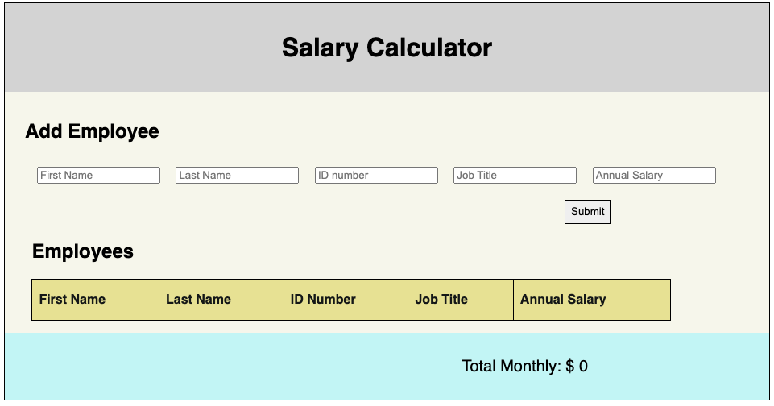

# Project Name
Salary Calculator

## Description
The Salary Calculator required the gathering of five pieces of employee data which were to be put into a table and cleared from the input form when the submit button was clicked. The total monthly salary of all the employees was to be calculated with a warning to be given if the total was above $20,000. Additionally, a delete button was to be created that allowed an employee's data to be cleared from the table.

This app created a simple display with a header, data entry section, employee data display, and a footer with the total salary. Upon submission of input, the program validates the data for completeness and data type and, if validated, posts the employee information to a table inclusive of a delete button. The total monthly cost is calculated upon submission and is also updated if an employee is deleted. If the total cost is too high the footer significantly changes visually so that the user is warned.

